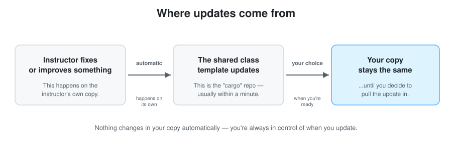

# Getting Updates

Every so often, your instructor fixes a bug or adds something new to the
course environment. This page explains how those changes reach you, and
what to do when they do.

You are never updated without asking first. Nothing changes in your copy
on its own — you choose when to pull in an update, the same way you choose
when to save your own work.



---

## How you'll know an update is available

Every time you start your container (open your codespace, or reopen it in
VS Code), it checks in the background and prints a short message in the
terminal if something new is available:

```
📦 2 update(s) available from the course template.
   Run 'cargo-update' to pick them up.
```

If you don't see this message, you're already up to date. (It only checks
about once every 6 hours, so if you *just* got an update from your
instructor, it might not show up in the terminal message immediately —
that's fine, it'll catch up.)

## Getting an update, step by step

1. Open a terminal (if you're in VS Code, there should already be one open
   at the bottom of the window — if not, use the menu: **Terminal → New
   Terminal**).
2. Type this and press Enter:
   ```bash
   cargo-update
   ```
3. Read what it prints. It'll either say you're already up to date, tell
   you it applied some updates successfully (and whether you need to
   rebuild — more on that below), or let you know there's a conflict that
   needs a person to sort out (see the next section).

That's it — one command. If nothing you've personally changed overlaps
with what the instructor changed, this finishes in a couple of seconds
with no extra steps.

### What `cargo-update` is doing, if you're curious

You never need to know this to use it, but in case you're curious: your
copy of the course environment is tracked by a tool called **git**, which
keeps a history of every change — a bit like a very thorough "Track
Changes" in a word processor. `cargo-update` is just a shortcut for two
ordinary git commands: `git fetch upstream` (download the instructor's
latest changes, without applying them yet) followed by `git merge
upstream/main` (actually apply them to your copy). Two words that will
help this make sense if you ever see them elsewhere:

- **`origin`** — the name git uses for *your* copy, the one you're
  currently working in.
- **`upstream`** — the name git uses for the *instructor's* shared
  version, the one updates come from. This is already set up for you —
  you don't need to add it yourself.

## If you see a "merge conflict"

This only happens if you edited the *exact same lines* of a file the
instructor also changed — for example, if you changed a setting in a
config file that your instructor also updated. Git will tell you exactly
which file(s) are affected and pause partway through.

This is not something you broke, and it's not urgent — it just means git
needs a human to decide which version to keep. If this happens, it's
completely fine to ask your instructor or a TA for help sorting it out
rather than guessing.

## Rebuilding after an update

Some updates only change files (documentation, scripts) and take effect
immediately. Others change the environment itself — for these, VS Code
will notice on its own and show a small popup asking if you want to
**rebuild** your container. Click yes. This takes a minute or two and is
completely safe — your own files and work are never touched by a rebuild.

If you don't see the popup but suspect something needs a rebuild, you can
always trigger it yourself: open the Command Palette
(<kbd>Cmd</kbd>+<kbd>Shift</kbd>+<kbd>P</kbd> on Mac,
<kbd>Ctrl</kbd>+<kbd>Shift</kbd>+<kbd>P</kbd> on Windows/Linux) and run
**"Dev Containers: Rebuild Container"**.
